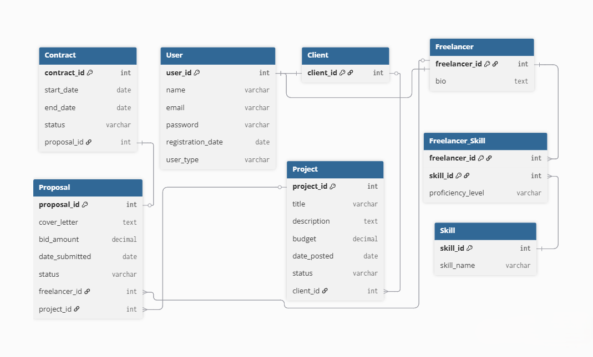
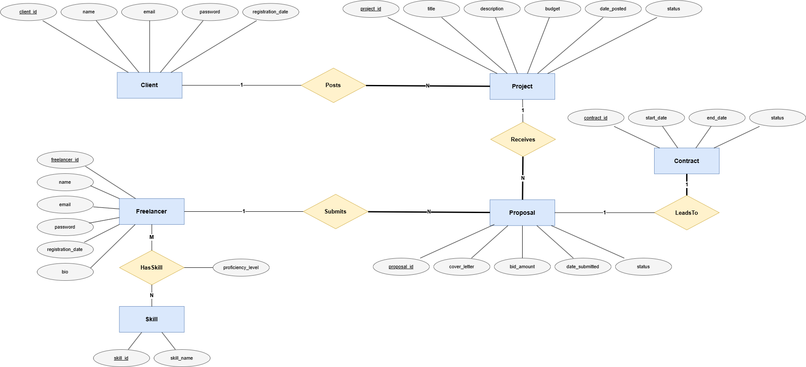
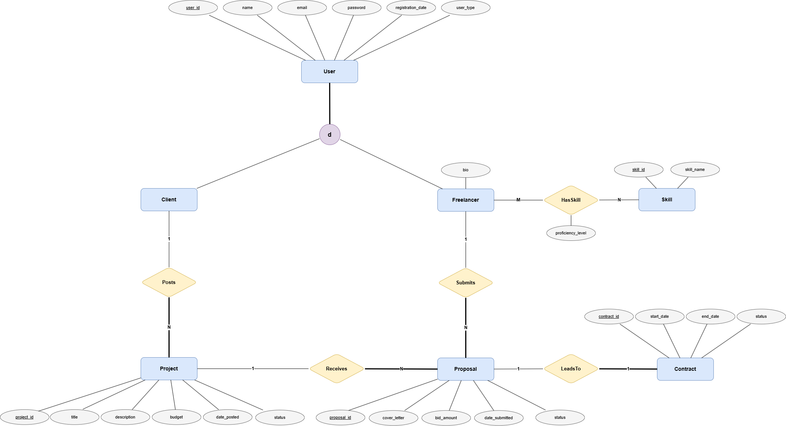

<div align="center">


# Freelance Marketplace Management System

### A polished PHP & MySQL database-driven web application for managing clients, freelancers, projects, proposals, contracts, and skills.

[](#)
[](#)
[](#)
[](#)

<div align="center">

## Live Demo

<p>
  <a href="https://freelance-marketplace.42web.io/" target="_blank">
    
  </a>
</p>

<p>
  <strong>Explore the deployed version of the Freelance Marketplace Management System.</strong>
</p>

<p>
  Browse the dashboard, clients, freelancers, projects, proposals, contracts, skills, and the full database-driven workflow online.
</p>

### 🌐 [Open Live Website](https://freelance-marketplace.42web.io/)

</div>

---


</div>

---

## Overview

**Freelance Marketplace Management System** is a portfolio-ready academic database project built with **PHP, MySQL, JavaScript, and CSS**.

The system models the core workflow of a simplified freelance marketplace where:

* Clients can be registered and managed.
* Freelancers can be registered with professional biographies.
* Clients can post projects.
* Freelancers can submit proposals to projects.
* Accepted proposals can be connected to contracts.
* Freelancers can be assigned multiple skills with proficiency levels.
* The system demonstrates relational database design, CRUD workflows, foreign keys, many-to-many relationships, and a normalized schema.

This project was developed as a **Database Systems Final Project** and also prepared as a clean web-based portfolio project.

---

## Project Interface

The application provides a professional dashboard-style interface with clear navigation across all system modules.

### Main Dashboard

The homepage acts as the main control panel for the system. It includes:

* Live database statistics.
* Total users count.
* Total clients count.
* Total freelancers count.
* Total projects count.
* Total proposals count.
* Total contracts count.
* Total skills count.
* Latest projects section.
* Latest proposals section.
* Quick action buttons for inserting new records.

### Navigation Modules

The system is divided into the following major interface sections:

| Module      | Description                                                          |
| ----------- | -------------------------------------------------------------------- |
| Home        | Main dashboard with statistics, quick actions, and recent activity   |
| Clients     | View, search, add, edit, and delete client records                   |
| Freelancers | View, search, add, edit, and delete freelancer profiles              |
| Projects    | Browse, filter, add, edit, delete, and view project details          |
| Proposals   | Manage freelancer bids submitted to projects                         |
| Contracts   | Manage contracts generated from accepted proposals                   |
| Skills      | Manage available skills and freelancer-skill assignments             |
| About       | Project overview, author profile, report link, and database diagrams |

---

## Key Features

### Database-Driven Dashboard

The dashboard reads directly from the MySQL database and displays real-time counts for the main system entities.

### Full CRUD Operations

The project includes Create, Read, Update, and Delete operations for the major database entities:

* Clients
* Freelancers
* Projects
* Proposals
* Contracts
* Skills
* Freelancer skill assignments

### Relational Data Workflow

The application demonstrates a realistic relational workflow:

1. A user is created as either a client or freelancer.
2. A client posts a project.
3. A freelancer submits a proposal.
4. An accepted proposal can generate a contract.
5. A freelancer can have many skills through a junction table.

### Project Details Page

Each project can be opened in a detailed view showing:

* Project information.
* Client information.
* Proposals submitted for the project.
* Contracts linked to the project.
* A simple relationship visualization.

### Search and Filtering

Several modules include useful browsing tools such as:

* Client search.
* Freelancer search.
* Proposal search.
* Project status filtering.

### Responsive Interface

The UI is built with custom CSS and JavaScript to provide:

* Responsive navigation.
* Animated counters.
* Scroll reveal effects.
* Interactive cards.
* Local SVG icons.
* Diagram lightbox support.
* A polished dashboard presentation.

---

## Technology Stack

| Layer               | Technology                      |
| ------------------- | ------------------------------- |
| Backend             | PHP                             |
| Database            | MySQL                           |
| Database Connection | MySQLi                          |
| Frontend            | HTML, CSS, JavaScript           |
| Styling             | Custom responsive CSS           |
| Icons               | Local SVG icons                 |
| Animation           | JavaScript ES modules           |
| Hosting             | InfinityFree / 42web deployment |

---

## Database Design

The database is designed around a normalized relational model for a freelance marketplace platform.

### Main Tables

| Table              | Purpose                                          |
| ------------------ | ------------------------------------------------ |
| `User`             | Stores common user account data                  |
| `Client`           | Represents users who can post projects           |
| `Freelancer`       | Represents users who can submit proposals        |
| `Project`          | Stores projects posted by clients                |
| `Proposal`         | Stores freelancer proposals for projects         |
| `Contract`         | Stores contracts created from accepted proposals |
| `Skill`            | Stores the skill catalog                         |
| `Freelancer_Skill` | Junction table between freelancers and skills    |

---

## Relationship Model

The system demonstrates multiple relationship types:

| Relationship          | Type | Description                                                                     |
| --------------------- | ---- | ------------------------------------------------------------------------------- |
| User → Client         | 1:1  | A client is a specialized user                                                  |
| User → Freelancer     | 1:1  | A freelancer is a specialized user                                              |
| Client → Project      | 1:N  | A client can post many projects                                                 |
| Freelancer → Proposal | 1:N  | A freelancer can submit many proposals                                          |
| Project → Proposal    | 1:N  | A project can receive many proposals                                            |
| Proposal → Contract   | 1:1  | One accepted proposal can generate one contract                                 |
| Freelancer → Skill    | M:N  | Freelancers can have many skills, and each skill can belong to many freelancers |

---

## Database Constraints

The SQL schema uses relational constraints to maintain data integrity:

* Primary keys for entity identity.
* Foreign keys for referential integrity.
* Unique constraints for values such as user emails and skill names.
* Composite primary key in `Freelancer_Skill`.
* One-to-one contract enforcement using a unique `proposal_id`.
* Check constraints for controlled values such as status and proficiency level.
* Cascading and restricted delete/update behavior where appropriate.

---

## Documentation and Diagrams

The repository includes complete academic documentation inside the `docs/` directory.

### Available Documentation

| File                                           | Description                          |
| ---------------------------------------------- | ------------------------------------ |
| `docs/Freelance_Marketplace_System_Report.pdf` | Full academic database report        |
| `docs/diagrams/schema.png`                     | Final relational schema              |
| `docs/diagrams/ERD.png`                        | Entity Relationship Diagram          |
| `docs/diagrams/EERD.png`                       | Enhanced Entity Relationship Diagram |

### Diagram Preview

#### Relational Schema



#### Entity Relationship Diagram



#### Enhanced Entity Relationship Diagram



---

## Repository Structure

```text
Freelance-Marketplace-System/
│
├── assets/
│   ├── css/
│   │   └── style.css
│   │
│   ├── icons/
│   │   ├── web_icon.png
│   │   ├── clients.svg
│   │   ├── contracts.svg
│   │   ├── dashboard.svg
│   │   ├── freelancers.svg
│   │   ├── projects.svg
│   │   ├── proposals.svg
│   │   ├── skills.svg
│   │   └── users.svg
│   │
│   ├── js/
│   │   ├── animations.js
│   │   ├── app.js
│   │   ├── hero.js
│   │   ├── icons.js
│   │   └── lightbox.js
│   │
│   └── vendor/
│
├── config/
│   └── db.example.php
│
├── database/
│   ├── schema.sql
│   ├── seed.sql
│   └── full_database.sql
│
├── docs/
│   ├── README.md
│   ├── Freelance_Marketplace_System_Report.pdf
│   └── diagrams/
│       ├── schema.png
│       ├── ERD.png
│       └── EERD.png
│
├── includes/
│   ├── footer.php
│   ├── header.php
│   ├── icon.php
│   └── navbar.php
│
├── pages/
│   ├── about.php
│   ├── clients.php
│   ├── freelancers.php
│   ├── projects.php
│   ├── project_details.php
│   ├── proposals.php
│   ├── contracts.php
│   ├── skills.php
│   ├── add_*.php
│   ├── edit_*.php
│   └── delete_*.php
│
└── index.php
```

---

## Main Pages

| Page                        | Purpose                                       |
| --------------------------- | --------------------------------------------- |
| `index.php`                 | Main dashboard                                |
| `pages/about.php`           | Project overview, documentation, and diagrams |
| `pages/clients.php`         | Client records                                |
| `pages/freelancers.php`     | Freelancer records                            |
| `pages/projects.php`        | Project records                               |
| `pages/project_details.php` | Detailed project view                         |
| `pages/proposals.php`       | Proposal records                              |
| `pages/contracts.php`       | Contract records                              |
| `pages/skills.php`          | Skills and freelancer-skill assignments       |

---

## Local Installation

### 1. Clone the Repository

```bash
git clone https://github.com/Nourelden-Elhakiem/Freelance-Marketplace-System.git
```

```bash
cd Freelance-Marketplace-System
```

---

### 2. Create the Database

Create a MySQL database, for example:

```sql
CREATE DATABASE freelance_marketplace;
```

Then select it:

```sql
USE freelance_marketplace;
```

---

### 3. Import the Database Schema

Import the schema file:

```text
database/schema.sql
```

This creates the full relational database structure.

---

### 4. Import Sample Data

Import the seed file:

```text
database/seed.sql
```

This inserts demo records for clients, freelancers, projects, proposals, contracts, and skills.

Alternatively, you can import:

```text
database/full_database.sql
```

if you want the complete database setup in one file.

---

### 5. Configure Database Connection

Copy:

```text
config/db.example.php
```

Rename it to:

```text
config/db.php
```

Then update the database credentials:

```php
$host = 'localhost';
$username = 'root';
$password = '';
$database = 'freelance_marketplace';
```

For hosting deployment, replace these values with the hosting MySQL credentials.

---

### 6. Run the Project

Place the project folder inside your local server directory, for example:

```text
htdocs/Freelance-Marketplace-System/
```

Then open:

```text
http://localhost/Freelance-Marketplace-System/
```

---

## Deployment

The project has been deployed online and can be accessed here:

```text
https://freelance-marketplace.42web.io/
```

The repository includes a deployment-ready configuration example using `config/db.example.php`, which can be copied to `config/db.php` and updated with the real hosting database credentials.

---

## Sample Demo Data

The seed file includes fictional demo data such as:

* Clients: Ahmed Hassan, Sara Ali, Karim Nabil
* Freelancers: Omar Khaled, Laila Samir, Mona Adel
* Projects: Business Website Redesign, Logo and Brand Kit, Product Description Writing, Portfolio Website
* Skills: PHP, MySQL, HTML, CSS, Graphic Design, Content Writing

The demo data is suitable for testing and presentation purposes.

---

## Academic Scope

This project demonstrates the following database concepts:

* Relational database design.
* Entity Relationship Diagram.
* Enhanced Entity Relationship Diagram.
* ISA specialization.
* EER-to-relational mapping.
* Primary keys and foreign keys.
* One-to-one relationships.
* One-to-many relationships.
* Many-to-many relationships.
* Junction tables.
* Normalization up to Third Normal Form.
* SQL implementation.
* Join queries.
* Aggregation queries.
* Update and delete operations with referential integrity awareness.

---

## Important Notes

This project is designed as an academic and portfolio database system.

For production-level usage, the following improvements are recommended:

* Add user authentication and sessions.
* Hash passwords using `password_hash()`.
* Add authorization roles.
* Add CSRF protection for forms.
* Add server-side validation layers.
* Add pagination for large tables.
* Add file upload support for freelancer portfolios.
* Add payment and review modules.
* Add API endpoints for frontend/backend separation.

---
## Author

**Nourelden Hany Elhakiem**
AI Engineer | Data Scientist

This project was designed and implemented by **Nourelden Hany Elhakiem** as part of an academic database systems project, with a focus on relational database design, system implementation, and professional web-based presentation.

### Professional Links

* **GitHub:** [Nourelden-Elhakiem](https://github.com/Nourelden-Elhakiem)
* **LinkedIn:** [Nourelden Elhakiem](https://www.linkedin.com/in/noureldenelhakiem/)


---

## License

This project is currently published as an academic portfolio project.
Add a license file if you want to define reuse, modification, or distribution permissions clearly.

---

<div align="center">

### Freelance Marketplace Management System

**A complete PHP & MySQL academic database project with a polished web interface, normalized schema, CRUD modules, documentation, and live deployment.**

</div>
